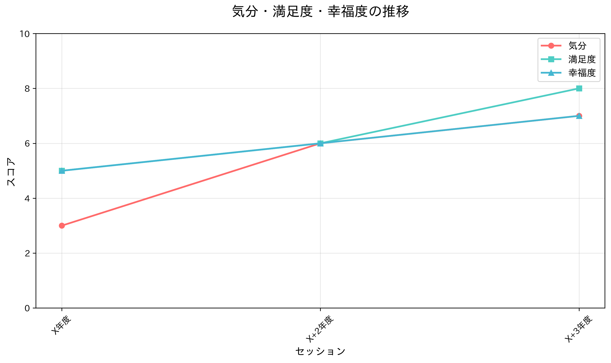

# キャリア相談支援レポート

## 概要

本レポートは、Aさん（場面緘黙症の診断を受けた高校生）に対する4年間のキャリア相談支援の経過と成果をまとめたものです。支援期間中、Aさんは対人関係の構築、問題解決スキルの習得、就職活動の成功など、着実な成長を遂げました。

## アセスメント推移

### 心理的指標の変化

上記グラフは、各セッションでのAさんの心理的指標（気分、満足度、幸福度）の推移を示しています。

**第1回面談（X年度）**
- 気分：3/10
- 満足度：5/10  
- 幸福度：5/10

**第2回面談（X+2年度）**
- 気分：6/10
- 満足度：6/10
- 幸福度：6/10

**第3回面談（X+3年度）**
- 気分：7/10
- 満足度：8/10
- 幸福度：7/10

### 分析

- **気分の改善**：3点から7点へと大幅な改善が見られ、特に第2回面談以降の安定した向上が特徴的です
- **満足度の向上**：5点から8点へと着実に向上し、最終的に最も高い評価を獲得しています
- **幸福度の改善**：5点から7点へと緩やかながら確実な向上を示しています

## 支援経過の詳細

### 第Ⅰ期（X年度～X+1年度）：継続的な登校を目標とした支援

#### 主な課題
- 体調不良を理由とした無断欠席・遅刻の頻発
- 電話連絡の困難
- 時間管理の不得手
- 希死念慮の訴え
- 対人関係での困難

#### 支援内容
1. **電話連絡スキルの習得**
   - 電話連絡の台本作成
   - 内線電話を使ったリハーサル実施
   - 担任と養護教諭による継続的な支援

2. **時間管理スキルの向上**
   - 1日のタイムスケジュール作成支援
   - スマートフォンのアラーム機能活用練習
   - 現実的なスケジュール設定の指導

3. **心理的支援**
   - 養護教諭による個別面接
   - 感情の言語化支援
   - 希死念慮への適切な対応

4. **医療機関との連携**
   - 思春期デイケアでのSST参加
   - 「場面緘黙」の確定診断
   - 月2回の継続的な受診

#### 成果
- 事前電話連絡ができるようになった
- 欠課時数超過を回避
- 適切な感情表現の増加
- 校内外での人間関係の積極性向上

### 第Ⅱ期（X+2年度）：対人関係の拡大と行動化への対応

#### 主な変化
- **積極的な活動の開始**
  - クラスメートとのカラオケ参加
  - 飲食店でのアルバイト開始
  - バレー部への入部
  - 恋愛関係の構築

#### 新たな課題
- 対人関係での「うまい関わり」の困難
- ストレスによる行動化
- 授業中の問題行動
- アルバイト先でのトラブル

#### 支援内容
1. **問題解決スキルの習得**
   - 感情の言語化支援
   - 対処方法の検討
   - ロールプレイによる練習

2. **ストレス管理の指導**
   - 深呼吸による気持ちの落ち着け方
   - 適切な感情表現の練習
   - ストレス発散方法の習得

3. **謝罪スキルの習得**
   - 個別SSTによる謝り方の練習
   - アルバイト先への適切な謝罪実施

#### 成果
- **欠席日数の大幅な減少**
  - X年度：35日
  - X+1年度：54日
  - X+2年度：9日
- 高校生らしい対人関係の構築
- 問題解決スキルの獲得
- 登校の安定化

### 第Ⅲ期（X+3年度）：就職活動と将来設計

#### 主な活動
- **積極的な就職活動**
  - 夏休み中に7社の見学（全校最多）
  - 製造業での1社目不採用
  - 物流業での2社目内定獲得

#### 支援体制の構築
1. **発達障害者支援センターとの連携**
   - 就職活動のバックアップ
   - 面接練習の実施
   - 卒業後の継続支援体制

2. **医療機関との継続連携**
   - 場面緘黙についての説明
   - 自己理解の促進
   - 障害受容の支援

3. **手帳取得の支援**
   - 精神障害者保健福祉手帳の申請
   - 診断書の取得
   - 自治体窓口への申請同行

#### 成果
- **就職内定の獲得**：物流業での就職決定
- **自己理解の進展**：障害受容と手帳取得への理解
- **支援体制の確立**：卒業後の継続支援体制の整備
- **4年次への無事な進級**

## 総合的な成果と評価

### 量的成果
- **登校の安定化**：年間欠席日数を54日から9日へ大幅改善
- **対人関係の拡大**：友達、アルバイト先、恋人との関係構築
- **就職活動の成功**：物流業での内定獲得
- **心理的指標の向上**：気分3→7、満足度5→8、幸福度5→7

### 質的成果
1. **ソーシャルスキルの習得**
   - 電話連絡スキル
   - 時間管理スキル
   - 問題解決スキル
   - 謝罪スキル

2. **心理的成長**
   - 感情の言語化能力向上
   - ストレス管理能力の習得
   - 自己理解の進展
   - 障害受容への理解

3. **社会的自立への準備**
   - 就労スキルの習得
   - 支援体制の構築
   - 卒業後の継続支援の確保

### 支援の特徴
1. **段階的なアプローチ**
   - 登校支援→対人関係支援→就職支援
   - 各段階での課題に応じた適切な支援

2. **多機関連携**
   - 学校（担任・養護教諭）
   - 医療機関
   - 発達障害者支援センター
   - アルバイト先

3. **継続的な支援体制**
   - 4年間にわたる一貫した支援
   - 卒業後の継続支援の確保

## 今後の課題と展望

### 課題
1. **就労継続の不安**
   - ストレス場面での行動化リスク
   - 場面緘黙によるコミュニケーション困難

2. **社会的孤立の防止**
   - 就職後の支援体制の活用
   - 地域での支援ネットワークの構築

### 展望
1. **就労支援の継続**
   - 発達障害者支援センターとの連携活用
   - 必要に応じた福祉就労への移行

2. **自立支援の推進**
   - 手帳を活用した支援の活用
   - 地域での生活支援体制の構築

## 結論

Aさんに対する4年間のキャリア相談支援は、着実な成果を上げることができました。特に、心理的指標の改善、登校の安定化、就職内定の獲得は、支援の効果を明確に示しています。

今後は、就労継続支援と社会的自立の促進が重要な課題となりますが、構築された支援体制を活用することで、Aさんのさらなる成長と自立が期待できます。

---

**レポート作成日**：X+4年3月  
**作成者**：キャリア相談担当者  
**データ期間**：X年度～X+3年度
